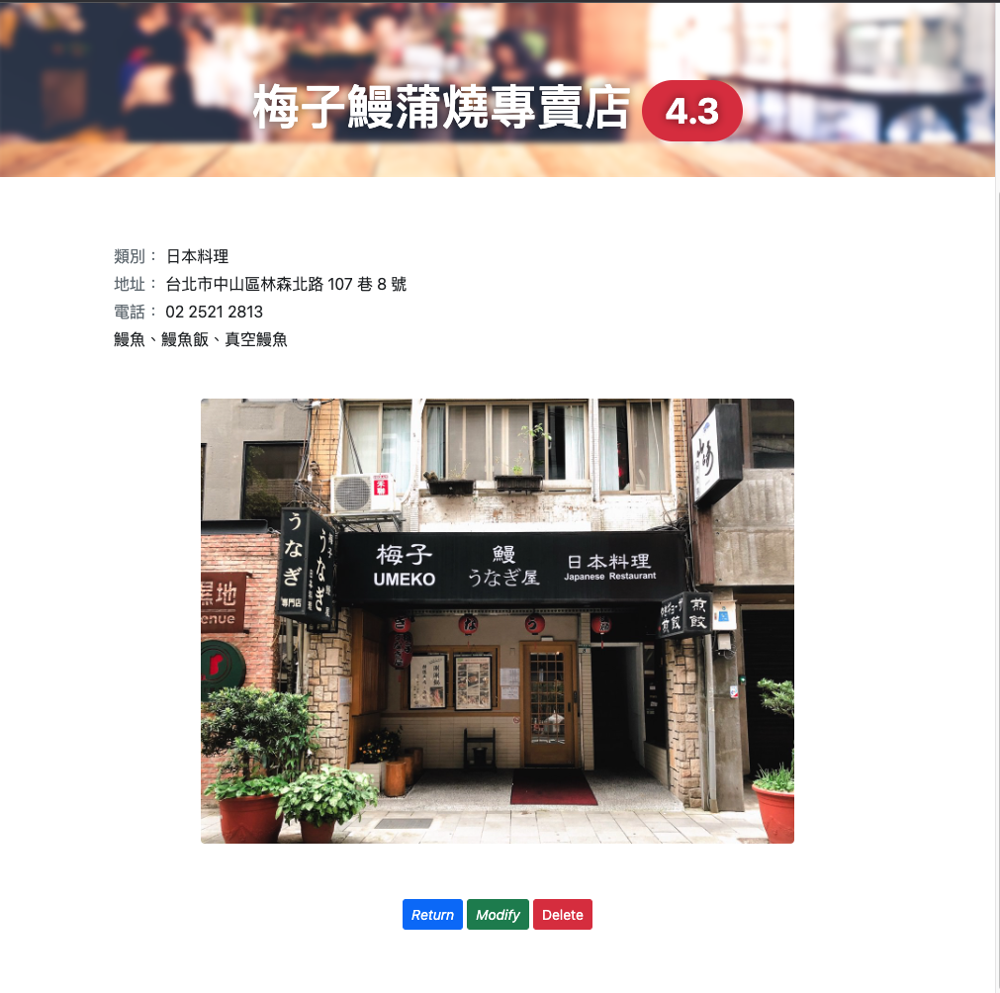
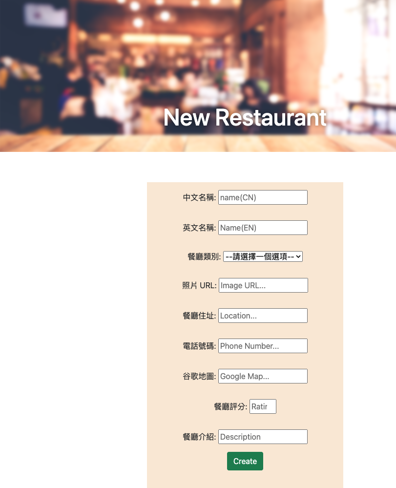

# Restaurant App

This repository contains a collection of restaurants along with their basic information.

This project is built with Node.js + Express.

MVC (Model, View and Control) +  CRUD (create, read, update and delete) function is included.

## Homepage

1. On the homepage, users can view a list of all the restaurants and their details:

  - photo
  - name
  - category
  - rating
  - Details


2. Users can click on a restaurant to view its detailed information, which includes:

  - Category
  - Address
  - Phone number
  - Description
  - Images
  - Searching for Restaurants



3. Users can also find specific restaurants using specific keywords:

  - Search by restaurant name.
  - Search by restaurant category.

  

4. User can create (and delete) their own restaurant.

## Seeders
The `restaurant.json` file is not a seeder file.
## Installation 
1. Clone this repository.

``` 
$ git clone https://github.com/candacechou/Restaurant
```

2. source into the directory

```
$ cd RESTAURANT
```

3. Install via npm

```
RESTAURANT/ $  npm install
```
4. Set up Database

- create restaurant table
```
RESTAURANT/ $ npx sequelize-cli db:migrate --name create-restaurant.js
```

- create user Table
```
RESTAURANT/ $ npx sequelize-cli db:migrate --name create-user.js
```
5.  Seed the test data.
```
RESTAURANT/ $ npm run seed:create
```
6. Un-seed the test data.
```
RESTAURANT/ $ npm run seed:undo 
```
7. raise the app.js via nodemon

```
RESTAURANT/ $  npm run dev 
```

8. to stop :

```
RESTAURANT/ $ CTRL+C
```

## Tools

- Node.js
- CSS, HTML
- Javascript
- express.js
- express-handlebars
- Bootstraps
- mysql2, sequelize, sequelize-cli
- method-override
- passport
- express-session, connect-flash